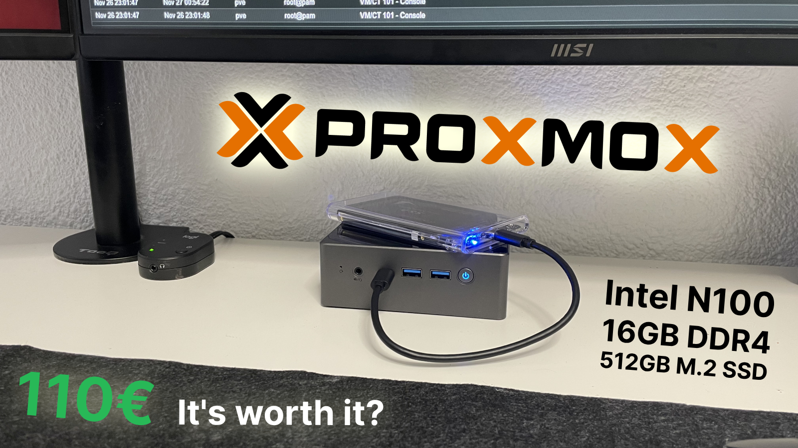
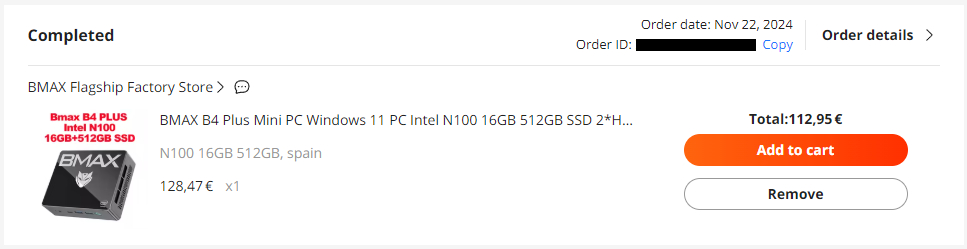

import Callout from "@/components/Callout.astro";
import Link from "@components/Link.astro";

---

## Why I Chose the BMAX B4 Plus 🖥️

During the Black Friday sales, I came across an amazing deal on AliExpress: the <Link href="https://aliexpress.com/item/1005007036843065.html" external={true}>BMAX B4 Plus</Link>, a compact Mini PC with an <Link href="https://www.intel.com/content/www/us/en/products/sku/231803/intel-processor-n100-6m-cache-up-to-3-40-ghz/specifications.html" external={true}>Intel N100</Link> processor, 16GB of RAM, and a 512GB M.2 SATA SSD—all for just **€112**. The specs immediately caught my attention as a potential homelab setup, and I couldn’t resist the opportunity to experiment.

---

## First Steps: Installing Proxmox VE 🛠️

As soon as I received the Mini PC, I installed <Link href="https://www.proxmox.com/en/proxmox-virtual-environment/overview" external={true}>Proxmox VE</Link>, a powerful virtualization platform. My goal was to turn this budget device into a multifunctional homelab capable of running:

- A multimedia server with <Link href="https://jellyfin.org/" external={true}>Jellyfin</Link> and the *ARR stack (<Link href="https://sonarr.tv/" external={true}>Sonarr</Link>, <Link href="https://radarr.video/" external={true}>Radarr</Link>, <Link href="https://overseerr.dev/" external={true}>Overseerr</Link>, etc.).
- Network tools like <Link href="https://adguard.com/en/adguard-home/overview.html" external={true}>AdGuard Home</Link>.
- Secure password management with <Link href="https://github.com/dani-garcia/vaultwarden" external={true}>Vaultwarden</Link>.
- And much more!

Proxmox VE allowed me to manage virtual machines and Linux containers easily, making it the perfect choice for this project.

---

## How Does the BMAX B4 Plus Perform? ⚙️

### 1. Hardware Overview
- **Processor:** Intel N100 (4 cores, efficient for light workloads).
- **RAM:** 16GB DDR4 (plenty for virtualization and multiple containers).
- **Storage:** 512GB M.2 SATA SSD (fast enough for most use cases, with room for expansion).
- **Ports:** Multiple USB ports, USB-C, HDMI, and Ethernet for connectivity.

The BMAX B4 Plus offers solid performance for a budget homelab, especially for tasks like hosting services or running lightweight virtual machines.

### 2. Real-World Performance
Running Proxmox VE on this Mini PC has been a smooth experience. With Jellyfin handling 1080p/4K video streams, the Intel N100 barely breaks a sweat. The 16GB of RAM ensures multiple containers can run simultaneously without noticeable slowdowns.

---

## Is It Worth the Price? 💸
For just €112, the BMAX B4 Plus is a **steal** for homelab enthusiasts on a budget. While it’s not a powerhouse, it’s more than capable of handling small-scale tasks like:
- Hosting personal media servers.
- Running development environments.
- Acting as a lightweight NAS or file server.

<Callout type="info">
If you're looking to dip your toes into virtualization and homelab setups, the BMAX B4 Plus is an excellent entry point.
</Callout>

---

## Limitations to Consider ⚠️
While the BMAX B4 Plus is impressive for its price, it does have some limitations:
1. **Storage:** The 512GB SSD can fill up quickly, especially when hosting large media libraries. Luckily, it supports storage expansion via external drives or a 2.5-inch SSD/HDD.
2. **Processor Power:** The Intel N100 is efficient but not designed for heavy workloads like transcoding 4K videos.
3. **Network:** Lacks Wi-Fi 6 and 2.5Gb Ethernet, which might be a drawback for advanced network setups.

---

## Final Thoughts: Is the BMAX B4 Plus for You? 🤔
The BMAX B4 Plus is a great choice for anyone looking to start a homelab without breaking the bank. It’s ideal for:
- Students and hobbyists experimenting with virtualization.
- Hosting small-scale services for personal use.
- Learning about networking and server management.

At €112, it offers unbeatable value and has exceeded my expectations as a budget homelab.

<Callout>
If you’re considering setting up your first homelab or want an affordable way to explore virtualization, the BMAX B4 Plus is definitely worth a look.
</Callout>

---

Have questions about setting up your own homelab? Let me know in the comments or check out my other guides for more inspiration! 🚀